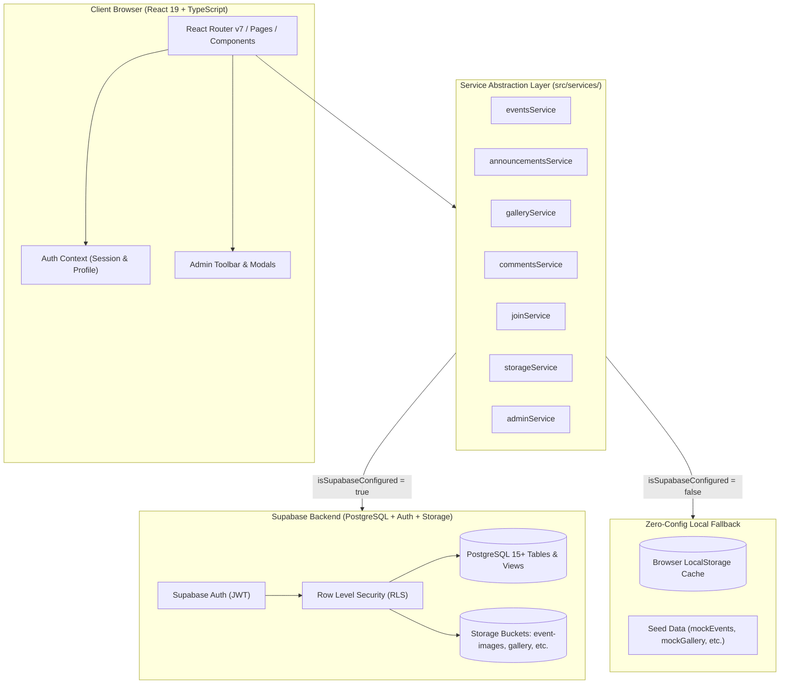
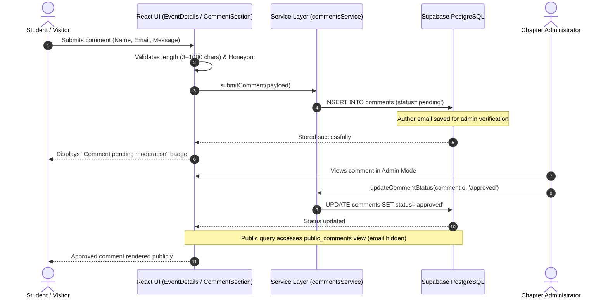

# CSI CMRIT — Web Portal & Chapter Management Platform

> Official web portal and content management system for the **Computer Society of India (CSI) Student Chapter** at **CMR Institute of Technology (CMRIT), Hyderabad**.

[](https://react.dev/)
[](https://www.typescriptlang.org/)
[](https://vite.dev/)
[](https://tailwindcss.com/)
[](https://supabase.com/)
[](#license)

---

## Overview

The **CSI CMRIT Portal** serves as the central digital hub for the Computer Society of India Student Chapter at CMR Institute of Technology, Hyderabad (UGC Autonomous). Founded nationally in 1965, the Computer Society of India (CSI) is the largest association of computer professionals in India and the country's representative body to the International Federation for Information Processing (IFIP).

This platform connects students, faculty mentors, and administrators through a modern web application designed for:

- **Flagship Event Management** — Publishing hackathons (such as AVISHKAAR and Smart India Hackathon internal screenings), technical workshops, guest lectures, and coding competitions.
- **Visual Archives & Galleries** — Multi-image albums, campus highlights, and event photo archives with fullscreen interactive lightboxes.
- **Chapter Circulars & Announcements** — Priority-tagged notices, deadline alerts, and official guidelines.
- **Student Membership Recruitment** — Paperless student onboarding with department, year, and technical interest tracking.
- **Audited Public Discourse** — A privacy-preserving comment and discussion system with bot detection, anti-flood timers, and administrative moderation.
- **In-Place & Dashboard Administration** — A dual-layer management experience allowing chapter officers to edit content directly in-context on live pages or via an administrative control center.

The application is engineered with a **zero-dependency fallback architecture**: it connects to a Supabase PostgreSQL backend with Row Level Security (RLS) when configured, but automatically falls back to an in-memory / `localStorage` mock engine when running in local development mode without database credentials.

---

## Key Features

### 🎓 Student & Visitor Experience

- **Interactive Homepage** — Dynamic hero banner, CSI India and CMRIT institutional profile, chapter impact metrics, why-join breakdown, and upcoming event highlights.
- **Event Discovery & Multi-Image Gallery** — Searchable and filterable event listings by category (`Workshop`, `Hackathon`, `Competition`, `Technical Session`). Individual event pages include date/time schedules, venue details, speaker profiles, highlights checklists, registration modals, and a multi-photo carousel with full-screen keyboard-navigable lightbox.
- **Official Announcements Feed** — Real-time circulars filterable by domain, with urgency tags, priority levels (`high`, `medium`, `low`), formatted article paragraphs, and file attachment support.
- **Chapter Gallery & Visual Archives** — Dedicated album grid with cover thumbnails, image count badges, tag filtering, and dedicated gallery post deep dives (`/gallery/:id`).
- **Student Membership Applications** — Structured registration form with validation for name, college email, contact phone, branch, academic year, and domain interests (Competitive Programming, Full Stack, AI/ML, Cloud/DevOps, Cybersecurity, etc.).
- **Campus Inquiries & Contact** — Dedicated contact portal with direct mail integration and interactive Google Maps campus location embed for CMRIT Hyderabad.
- **Privacy-Preserving Comment System** — Public visitors can comment on events, announcements, and gallery posts. Emails are collected solely for admin verification and spam tracking, and are omitted from the public database view (`public_comments`).

### 🛡️ Administrative Capabilities

- **In-Place Content Administration** — Authenticated admins can create new events, publish announcements, and upload gallery posts directly from the live public layout via sticky admin toolbars and modals without navigating away.
- **Pin & Status Controls** — One-click toggles to pin featured content to the top of feeds, switch between `draft` and `published` states, or archive expired entries.
- **Submissions Hub** — Slide-out drawer to review incoming student membership applications and contact messages with status toggling (`pending`, `approved`, `rejected`).
- **Moderation Queue & Anti-Abuse** — In-thread and dashboard comment approval/rejection workflows, bot honeypot protection, cooldown timers, and one-click email blacklisting (`blocked_emails` table).
- **Admin Profile & Security Center** — Editable officer profiles (display name, designation, department, phone, bio, custom avatar upload) and session management.

---

## Technical Architecture

The application is built as a single-page application (SPA) using React 19 and TypeScript, powered by Vite. The service layer abstracts backend communication through modular service classes that support both remote Supabase operations and local persistence fallbacks.



### Application Data Flow



---

## Tech Stack

| Layer | Technology | Version | Purpose |
| :--- | :--- | :--- | :--- |
| **Frontend Framework** | [React](https://react.dev/) | `^19.0.0` | Declarative component UI library |
| **Runtime / Language** | [TypeScript](https://www.typescriptlang.org/) | `~5.7.2` | Static typing, interface definitions, and compile-time safety |
| **Build Tool & Bundler** | [Vite](https://vite.dev/) | `^6.1.0` | Hot Module Replacement (HMR) and optimized ES production builds |
| **Routing** | [React Router](https://reactrouter.com/) | `^7.3.0` | Client-side routing, layout nesting, and URL param management |
| **Styling** | [Tailwind CSS](https://tailwindcss.com/) | `^3.4.17` | Utility-first CSS framework with customized design tokens |
| **CSS Processing** | [PostCSS](https://postcss.org/) / [Autoprefixer](https://github.com/postcss/autoprefixer) | `^8.5.2` | CSS syntax transformation and vendor prefixing |
| **Icons** | [Lucide React](https://lucide.dev/) | `^1.16.0` | Modern, consistent vector iconography |
| **Backend / Database** | [Supabase](https://supabase.com/) | `^2.116.0` | Managed PostgreSQL database, authentication, and object storage |
| **Linter** | [Oxlint](https://oxc.rs/) | Embedded | High-performance Rust-based JavaScript/TypeScript linter |

---

## Project Structure

```text
CSI-Cmrit/
├── .env.example              # Template environment variables
├── .gitignore                # Git ignore configuration
├── .oxlintrc.json            # Oxlint configuration for React & TypeScript
├── index.html                # Single-page application entry point
├── package.json              # Package manifest and npm scripts
├── postcss.config.js         # PostCSS configuration for Tailwind
├── tailwind.config.js        # Design tokens, color palette, and custom animations
├── tsconfig.json             # Root TypeScript project reference configuration
├── tsconfig.app.json         # Client TypeScript compiler options
├── tsconfig.node.json        # Build-tool TypeScript compiler options
├── vite.config.ts            # Vite configuration with React plugin
│
├── public/                   # Static public assets
│   ├── favicon.svg           # Site favicon
│   ├── images/               # Campus photographs, posters, and student assets
│   │   ├── Team/             # Faculty coordinator & student core team portraits
│   │   ├── logos/            # Official CSI & CMRIT institutional emblems
│   │   └── avishkaar_*.png   # Flagship AVISHKAAR 2026 hackathon visuals
│
├── src/                      # Application source code
│   ├── assets/               # Bundled static media
│   ├── components/           # Reusable UI component library
│   │   ├── admin/            # Administrative views, account settings, and security
│   │   │   └── in-place/     # Contextual modals (EventModal, AnnouncementModal, GalleryModal, Drawer)
│   │   ├── announcements/    # Announcement feed cards and priority badges
│   │   ├── common/           # Navbar, Footer, Button, Badge, Modal, Toast, CommentSection, ConfirmDialog
│   │   ├── events/           # EventCard, RegisterModal
│   │   ├── gallery/          # GalleryCard, GalleryPostCard, LightboxModal
│   │   └── home/             # HeroSection, HomeAboutRow, WhatWeDo, WhyJoinCsi
│   ├── context/
│   │   └── AuthContext.tsx   # Supabase Auth provider, admin session persistence, and profile sync
│   ├── data/                 # Seed data and offline fallback fixtures
│   │   ├── aboutTeam.ts      # Faculty coordinator and student council 2025–26 profiles
│   │   ├── announcements.ts  # Default announcements (SIH 2026, Avishkar)
│   │   ├── events.ts         # Default event fixtures (AVISHKAAR 2026 Hackathon)
│   │   └── gallery.ts        # Default chapter highlights and image archives
│   ├── lib/
│   │   ├── authGuard.ts      # Client-side authorization assertions for admin operations
│   │   └── supabaseClient.ts # Supabase client initialization and connection health detector
│   ├── pages/                # Routed views
│   │   ├── About.tsx         # National CSI India history, CMRIT chapter mission, team directory
│   │   ├── AdminDashboard.tsx# Comprehensive admin dashboard (analytics, content, moderation)
│   │   ├── AdminLogin.tsx    # Dedicated administrator authentication screen
│   │   ├── AnnouncementDetails.tsx # Full-page single announcement view
│   │   ├── Announcements.tsx # Searchable and categorized announcement feed
│   │   ├── ChapterHighlights.tsx   # Visual archives view
│   │   ├── Contact.tsx       # Campus location, map embed, and contact inquiry form
│   │   ├── EventDetails.tsx  # Detailed event view with agenda, multi-image gallery, and comments
│   │   ├── Events.tsx        # Filterable event directory
│   │   ├── GalleryDetail.tsx # Multi-image gallery album view with lightbox modal
│   │   ├── GalleryPage.tsx   # Visual photo gallery grid
│   │   ├── Home.tsx          # Landing page
│   │   └── JoinUs.tsx        # Student chapter membership application form
│   ├── services/             # Data access and API service layer
│   │   ├── activityService.ts      # Audit and activity logging
│   │   ├── adminService.ts         # Dashboard analytics aggregation and profile updates
│   │   ├── announcementsService.ts # CRUD for announcements
│   │   ├── commentsService.ts      # Public comment submission and admin moderation
│   │   ├── contactService.ts       # Contact message submissions and inbox
│   │   ├── eventsService.ts        # CRUD and pinning for events
│   │   ├── galleryService.ts       # Multi-image gallery post handling
│   │   ├── highlightsService.ts    # Visual chapter highlight archives
│   │   ├── joinService.ts          # Student membership applications workflow
│   │   └── storageService.ts       # Supabase bucket upload and validation (5MB, JPEG/PNG/WebP/PDF)
│   ├── types/
│   │   └── index.ts          # Central domain models and TypeScript type declarations
│   ├── App.tsx               # Route declarations, PublicLayout wrapper, and modal event listeners
│   ├── index.css             # Tailwind base layers and custom utility classes
│   └── main.tsx              # DOM mounting and application bootstrap
│
└── supabase/                 # Database migrations and policies
    ├── schema.sql            # Base schema (tables, RLS policies, storage buckets, triggers, views)
    └── schema_migration.sql  # Schema migration v2 (gallery posts, multi-images, activity log)
```

---

## Database Design & Security

The database schema is defined in [supabase/schema.sql](file:///c:/Users/haric/OneDrive/Desktop/CSI-Cmrit/supabase/schema.sql) and [supabase/schema_migration.sql](file:///c:/Users/haric/OneDrive/Desktop/CSI-Cmrit/supabase/schema_migration.sql). It leverages PostgreSQL with native Row Level Security (RLS) enabled on all tables.

### Database Tables & Schema Overview

| Table | Primary Key | Key Columns | Purpose | Access Control (RLS) |
| :--- | :--- | :--- | :--- | :--- |
| `admins` | `id (UUID)` | `full_name`, `email`, `role`, `avatar_url` | Stores administrator profiles linked to `auth.users(id)` | Admins view/update own record; Super Admins have full access |
| `events` | `id (UUID)` | `slug`, `title`, `category`, `event_date`, `event_time`, `venue`, `description`, `highlights[]`, `status` | Chapter workshops, hackathons, and sessions | Public read for `status = 'published'`; Admins full CRUD |
| `announcements` | `id (UUID)` | `slug`, `title`, `category`, `summary`, `content[]`, `priority`, `status`, `published_at` | Official notices and circulars | Public read for `status = 'published'`; Admins full CRUD |
| `highlights` | `id (UUID)` | `title`, `category`, `event_date`, `caption`, `image_url`, `status` | Visual photo archive entries | Public read for `status = 'published'`; Admins full CRUD |
| `gallery_posts` | `id (UUID)` | `slug`, `title`, `description`, `category`, `cover_image`, `event_date`, `tags[]`, `status` | Multi-image album headers | Public read for `status = 'published'`; Admins full CRUD |
| `gallery_images` | `id (UUID)` | `gallery_post_id`, `image_url`, `caption`, `display_order` | Child images for gallery posts (`ON DELETE CASCADE`) | Public read for images of published posts; Admins full CRUD |
| `join_applications`| `id (UUID)` | `full_name`, `email`, `year`, `branch`, `phone`, `reason`, `status` | Student chapter membership inquiries | Public insert only (`status = 'pending'`); Admins full read/write |
| `contact_messages` | `id (UUID)` | `name`, `email`, `subject`, `message`, `is_read` | Inquiries submitted via Contact page | Public insert only; Admins full read/write |
| `comments` | `id (UUID)` | `target_type`, `target_id`, `author_name`, `author_email`, `content`, `status` | Comments on events, highlights, announcements | Public insert (`pending`, unblocked email); Admins full CRUD |
| `blocked_emails` | `id (UUID)` | `email`, `reason`, `blocked_by` | Blacklisted email addresses for anti-spam enforcement | Admins full access; checked on public comment submission |
| `activity_log` | `id (UUID)` | `admin_id`, `admin_name`, `action`, `target_type`, `target_id`, `target_title` | Audit log of administrative actions | Admins read/insert only |

### Privacy & Data Protection

- **`public_comments` View**: A PostgreSQL security view that exposes only `id`, `target_type`, `target_id`, `author_name`, `content`, and `created_at` where `status = 'approved'`. The author's email is strictly filtered out to prevent public exposure.
- **Automated `updated_at` Triggers**: Applied via `handle_updated_at()` PL/pgSQL function across all updateable tables.
- **Database Functions**: `is_admin()` and `is_super_admin()` evaluate `auth.uid()` against the `admins` table to enforce secure role validation directly in SQL policies.

### Storage Buckets

The system configures four public buckets under Supabase Storage with strict MIME type restrictions and a 5 MB file size limit:

1. `event-images` — JPEG, PNG, WebP
2. `highlights` — JPEG, PNG, WebP
3. `announcements` — JPEG, PNG, WebP, PDF (for official documents)
4. `gallery` — JPEG, PNG, WebP

*Storage Security:* Anyone can download/view files via public CDN URLs; only authenticated users who pass `public.is_admin()` are permitted to upload or delete objects.

---

## Getting Started

### Prerequisites

Ensure the following tools are installed on your workstation:

- **Node.js**: `v18.0.0` or higher (Node.js 20+ LTS recommended)
- **Package Manager**: `npm` (v9 or v10) or compatible (`pnpm` / `yarn`)
- **Git**: Installed and accessible in your shell
- **Supabase Account** *(Optional for local preview)*: Free-tier project at [supabase.com](https://supabase.com/) if you wish to run with live cloud persistence.

---

### Installation

1. **Clone the repository:**
   ```bash
   git clone https://github.com/sakshii1805/CSI-Cmrit.git
   cd CSI-Cmrit
   ```

2. **Install project dependencies:**
   ```bash
   npm install
   ```

---

### Environment Variables

The project includes an [.env.example](file:///c:/Users/haric/OneDrive/Desktop/CSI-Cmrit/.env.example) template. Create a local `.env` file in the project root:

```bash
cp .env.example .env
```

Configure the following variables in `.env`:

| Variable | Required | Description | Example |
| :--- | :---: | :--- | :--- |
| `VITE_SUPABASE_URL` | **No\*** | Supabase project API URL (from Project Settings > API) | `https://your-project-id.supabase.co` |
| `VITE_SUPABASE_ANON_KEY` | **No\*** | Supabase public anonymous API key (JWT) | `eyJhbGciOiJIUzI1NiIsInR5cCI6...` |

> [!NOTE]
> **\*Zero-Config Fallback Mode:**
> If `VITE_SUPABASE_URL` and `VITE_SUPABASE_ANON_KEY` are omitted or retain placeholder values, the application automatically boots into **Local Dev Preview Mode**. It uses `localStorage` and bundled mock datasets so you can preview, interact with, and develop the interface without setting up an external database.

---

### Database Setup (When connecting to Supabase)

If you are connecting the project to a live Supabase instance:

1. Open your Supabase project dashboard.
2. Navigate to **SQL Editor**.
3. Copy and run the contents of [supabase/schema.sql](file:///c:/Users/haric/OneDrive/Desktop/CSI-Cmrit/supabase/schema.sql) to create tables, triggers, RLS policies, and storage buckets.
4. Copy and run the contents of [supabase/schema_migration.sql](file:///c:/Users/haric/OneDrive/Desktop/CSI-Cmrit/supabase/schema_migration.sql) to add gallery posts, activity logging, and updated status constraints.
5. Create your initial admin user in Supabase under **Authentication > Users**, then insert a corresponding record into the `public.admins` table with `role = 'super_admin'`.

---

## Running Locally

Start the Vite development server:

```bash
npm run dev
```

The application will be accessible at:
```text
http://localhost:5173/
```

To expose the development server to your local network (e.g. for testing on mobile devices):
```bash
npm run dev -- --host
```

---

## Available Scripts

All available scripts defined in [package.json](file:///c:/Users/haric/OneDrive/Desktop/CSI-Cmrit/package.json):

| Command | Action |
| :--- | :--- |
| `npm run dev` | Starts the Vite local development server with Hot Module Replacement (HMR). |
| `npm run build` | Compiles TypeScript declarations (`tsc -b`) and builds production-optimized static bundles into the `dist/` folder. |
| `npm run preview` | Runs a local web server serving the compiled production build from `dist/` to verify bundling and chunking behavior. |

---

## Application Routes

| Path | Component | Description | Access Level |
| :--- | :--- | :--- | :--- |
| `/` | `Home.tsx` | Main landing page with hero, mission overview, stats, and upcoming events | Public |
| `/about` | `About.tsx` | History of CSI India, CMRIT Chapter context, faculty & student team directory | Public |
| `/events` | `Events.tsx` | Categorized and searchable directory of workshops, hackathons, and sessions | Public |
| `/events/:id` | `EventDetails.tsx` | Event agenda, speaker profile, multi-image gallery, registration, and comments | Public |
| `/gallery` | `GalleryPage.tsx` | Visual albums and photo records of chapter activities | Public |
| `/gallery/:id` | `GalleryDetail.tsx` | Deep-dive multi-image view for a specific event album | Public |
| `/highlights` | `ChapterHighlights.tsx` | Filterable visual highlight wall | Public |
| `/announcements` | `Announcements.tsx` | Official circulars, recruitment notices, and event updates | Public |
| `/announcements/:id`| `AnnouncementDetails.tsx` | Full-text view of an announcement with attachments | Public |
| `/join` | `JoinUs.tsx` | Student membership application form with technical domain selection | Public |
| `/contact` | `Contact.tsx` | Direct campus contact details, map location, and inquiry submission | Public |
| `/admin/login` | `AdminLogin.tsx` | Dedicated administrator authentication portal | Public / Admin |
| `/admin/*` | `App.tsx` | Redirects to integrated in-place admin mode on `/` when logged in | Authenticated |

---

## Security & Privacy Considerations

1. **Client-Side Authorization Assertions**  
   All administrative actions (`createEvent`, `deleteAnnouncement`, `updateApplicationStatus`, etc.) execute client-side authorization checks via [authGuard.ts](file:///c:/Users/haric/OneDrive/Desktop/CSI-Cmrit/src/lib/authGuard.ts) prior to sending network requests.
2. **PostgreSQL Row Level Security (RLS)**  
   Every table in Supabase enforces RLS policies. Even if client credentials are leaked, anonymous users can only insert pending applications/messages and read published entries. Only authenticated admins can mutate content.
3. **Comment Privacy**  
   The `public_comments` view strips commenter email addresses. Public API calls never receive or expose commenter email data in responses.
4. **Anti-Spam & Abuse Prevention**  
   - Hidden honeypot inputs on comment and contact forms to trap automated bots.
   - 30-second submission cooldown timers in the user interface.
   - Database foreign-check against `blocked_emails` to automatically reject flagged bad actors.
5. **Secure Storage Constraints**  
   Storage uploads restrict file sizes to 5 MB and enforce explicit MIME validation on both client and bucket policy levels.

---

## Contributing

Contributions from students and open-source contributors are welcome. Follow these steps:

1. **Fork the repository** on GitHub.
2. **Create a descriptive feature branch:**
   ```bash
   git checkout -b feature/event-calendar-view
   ```
3. **Make your changes** while keeping code formatted and typed.
4. **Verify the build passes without errors:**
   ```bash
   npm run build
   ```
5. **Commit your changes using conventional messages:**
   ```bash
   git commit -m "feat: add calendar view to events directory"
   ```
6. **Push to your branch:**
   ```bash
   git push origin feature/event-calendar-view
   ```
7. **Open a Pull Request** against the `main` branch with a clear description of changes.

---

## License

No explicit open-source license file is currently present in the repository. All rights are reserved by the **Computer Society of India — CMRIT Student Chapter** and **CMR Institute of Technology, Hyderabad**. Contact the chapter administrators for permissions regarding code reuse or adaptation.

---

## Institutional Acknowledgements

- **[Computer Society of India (CSI India)](https://csiindia.org/)** — National professional body for computing professionals in India (founded 1965).
- **[CMR Institute of Technology, Hyderabad](https://cmritonline.ac.in/)** — UGC Autonomous institution, Kandlakoya, Hyderabad, Telangana.
- **Faculty Coordinator**: P. Sathish Kumar Reddy (Department of Computer Science & Engineering).
- **Student Council 2025–26**: CSI CMRIT Core Executive Team.
